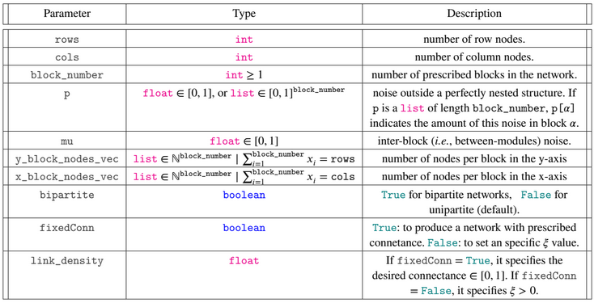

# BUNGen: Synthetic generator for structured ecological networks

BUNGen (Bipartite and Unipartite Network Generator) is a Python software designed to address the methodological gap in synthetic network generation. BUNGen facilitates the creation of uni- and bipartite networks with varying levels of prescribed structures, offering a versatile tool for exploring the consequences of network architecture in ecological studies.
For more details, refer to the paper #LinkToPaper#

## Project Overview

### Project Structure

    .
    ├── config                                # Path config files
    │   ├── __init__.py
    │   └── config.py                       
    ├── Empirical_Net
    │   ├── Pollination
    │   └── Seed_Dispersal
    ├── figures                              # Contains the BUNGen paper figures
    ├── netgen                               # Main library
    │   ├── NetworkGenerator.py              # Generate structured networks
    │   ├── generate_probability_matrix.py   # Generate synthetic network matrix of link probabilities with the define parameters
    │   ├── utils.py                         # Util functions used in NetworkGenerator
    │   └── __init__.py
    ├── scripts                              # 
    │   ├── __init__.py
    │   └── paper_figures_bungen.py          # Produce the BUNGen paper figures
    ├── tests                                # Unitary tests
    │   ├── __init__.py
    │   └── bungen_test.py
    ├── .gitignore
    ├── README.md
    ├── LICENSE
    └── requirements.txt                    # Python software requirements

## Getting Started

To install and use BUNGen, follow the steps below

### Prerequisites

    - Python 3.8+
    - Pip

### Installation

Clone the repository:

    git clone https://github.com/COSIN3-UOC/BUNGen.git

Install the required packages:

    pip install -r requirements.txt

## Usage
### Model inputs:

### Output:
A numpy matrix that corresponds to the binary synthetic adjacency matrix (biadjacency for bipartite cases), and/or a numpy matrix with link probabilities, two lists of ints containing the rows and columns partition labels, respectively.

## Use examples: 
### To use as a library
To produce a single network with desired parameters within a custom made script. User can proceed in the following way.

	from netgen import NetworkGenerator
	
	gen = NetworkGenerator(rows=48,
							columns=48,
							block_number=4,
							p=0.0,
							mu=0.0,
							y_block_nodes_vec=[20, 16, 8, 4],
							x_block_nodes_vec=[16, 20, 4, 8],
							bipartite=True,
							fixedConn=False,
							link_density=1.0)

	Ma,* _ = gen()

Keep in mind that the parameters are positional. If user does not pass the parameters as named arguments, then order must be respected. If the user wants the function to return the matrix of link probabilities edit the line above by replacing M,* _ = with M,Pij,* _ =  or if the users wants the rows and columns partition labels edit the line above as M,Pij,rowsLabels,colsLabels =

# Citations
Harry R. de los Ríos, María J. Palazzi, Aniello Lampo, Albert Solé-Ribalta, Javier Borge-Holthoefer

A. Solé-Ribalta, CJ. Tessone, M S. Mariani, and J Borge-Holthoefer. Revealing in-block nestedness: Detection and benchmarking, Phys. Rev. E 97, 062302 (2018). DOI: [10.1103/PhysRevE.97.062302](https://doi.org/10.1103/PhysRevE.97.062302)

MJ Palazzi, J Borge-Holthoefer, CJ Tessone and A Solé-Ribalta. Macro- and mesoscale pattern interdependencies in complex networks. J. R. Soc. Interface, 16, 159, 20190553 (2019). DOI: [10.1098/rsif.2019.0553](https://doi.org/10.1098/rsif.2019.0553)
