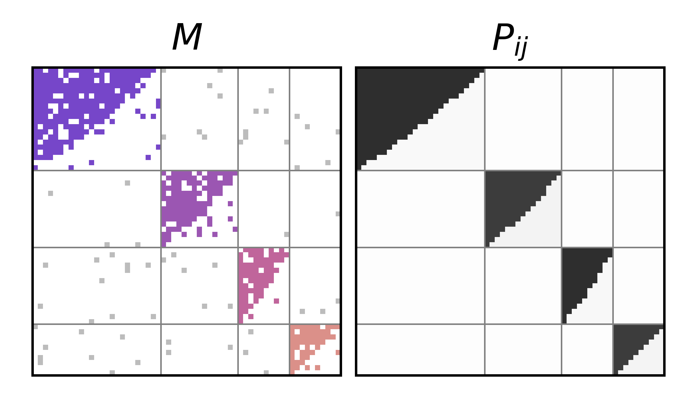
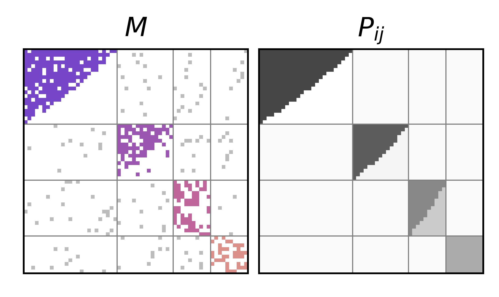

# BUNGen: Synthetic generator for structured ecological networks

BUNGen (Bipartite and Unipartite Network Generator) is a Python software designed to address the methodological gap in synthetic network generation. BUNGen facilitates the creation of uni- and bipartite networks with varying levels of prescribed structures, offering a versatile tool for exploring the consequences of network architecture in ecological studies. 

This package includes a class definition, with its associated internal methods, which correspond to equations 1-2-3-4-5-6 in the main paper.

For more details, refer to the main paper #LinkToPaper#

## Project Overview

### Project Structure

    .
    ├── config                                # Path config files
    │   ├── __init__.py
    │   └── config.py                       
    ├── Empirical_Net
    │   ├── Pollination
    │   └── Seed_Dispersal
    ├── figures                              # Contains the BUNGen paper figures
    ├── netgen                               # Source files
    │   ├── NetworkGenerator.py              # Generate structured networks
    │   ├── generate_probability_matrix.py   # Generate synthetic network matrix of link probabilities with the define parameters
    │   ├── utils.py                         # Util functions used in NetworkGenerator
    │   └── __init__.py
    ├── scripts                              # 
    │   ├── __init__.py
    │   └── paper_figures_bungen.py          # Produce the BUNGen paper figures
    ├── tests                                # Unitary tests
    │   ├── __init__.py
    │   └── bungen_test.py
    ├── .gitignore
    ├── README.md
    ├── LICENSE
    └── requirements.txt                    # Python software requirements

## Getting Started

To install and use BUNGen, follow the steps below

### Prerequisites

    - Python 3.8+
    - Pip

### Installation

Clone the repository:

    git clone https://github.com/COSIN3-UOC/BUNGen.git


Install the required packages:

    pip install -r requirements.txt


## Implementation and Usage
The class constructor `NetworkGenerator` requires several parameters to build the network object. A succinct description of these parameters is available in Table S1.

Besides the common network parameters, such as network size (`rows` and `columns`) or the number of specified communities (`block_number`), other parameters to control noise, density, and the characteristics of the communities are included. The intra- and inter-community noise is controlled by parameters `p` and `mu`, conveniently corresponding to  *p* and *mu* as defined in Section II of the main text.

Notably, `p` can be a single float value, such that every block will share the same level of intra-block noise; or as a list of floats, such that intra-block noise is defined for each block separately. Parameters `link_density` and `fixedConn` allow the user to specify the network connectance or else, let the connectance be automatically specified by the shape of the nested structure, ruled by $\xi$. Regarding the community structure, parameters `y_block_node_vec` and `x_block_node_vec` allow to control the size of the communities, with freedom to generate regular or heterogenous group size distributions, *e.g.*, sampling their values from any distribution and method chosen by the user. Finally, the parameter `bipartite` allows the user to specify if the generated networks should be considered bipartite or unipartite.

After the constructor has been initialised, the network object is created as:
```python
M, Pij, crows, ccols = gen()
```
from which we obtain two *numpy* matrices: 
- a binary *M* with presence/absence values,
- a per-cell probability matrix *Pij*;
- and two lists indicating the ascription of row and column nodes to a given block or module. 

Each module is tagged as an integer in the range $[0, B-1]$. 
If any of those output objects is not needed, they can be skipped by simply replacing the variable by **_**.
To illustrate the behaviour of these parameters, Tables **S2** and **S3** place actual code and the obtained output side by side, with several examples how these parameters can be combined to obtain different network structures --nested, modular and in-block nested.


| Parameter      | Type                                                                                       | Description                                                                                                                                          |
|----------------|--------------------------------------------------------------------------------------------|------------------------------------------------------------------------------------------------------------------------------------------------------|
| rows           | `int`                                                                                      | number of row nodes.                                                                                                                                 |
| cols           | `int`                                                                                      | number of column nodes.                                                                                                                              |
| block_number   | `int` ≥ 1                                                                                  | number of prescribed blocks in the network.                                                                                                          |
| p              | `float` ∈ [0, 1], or `list` ∈ $[0,1]^{\{block\_number}} $                             | noise outside a perfectly nested structure. If **p** is a `list` of length **block_number**, **p[α]** indicates the amount of this noise in block α. |
| mu             | `float` ∈ [0, 1]                                                                           | inter-block (i.e., between-modules) noise.                                                                                                           |
| y_block_nodes_vec | `list ∈ `$N^{\{block\_number}} $` \|` $\sum_{i=1}^{\{block\_number}} x_i$ = rows          | number of nodes per block in the y-axis.                                                                                                             |
| x_block_nodes_vec | `list ∈ `$N^{\{block\_number}} $` \|` $\sum_{i=1}^{\{block\_number}} x_i$ = cols | number of nodes per block in the x-axis.                                                                                                             |
| bipartite      | `boolean`                                                                                  | `True` for bipartite networks, `False` for unipartite (default).                                                                                     |
| fixedConn      | `boolean`                                                                                  | `True`: to produce a network with prescribed connectance. `False`: to set a specific ξ value.                                                        |
| link_density   | `float`                                                                                    | If **fixedConn** = `True`, it specifies the desired connectance ∈ [0, 1]. If **fixedConn** = `False`, it specifies ξ > 0.                             |

**Table S1**: *Description of synthetic benchmark input parameters*

### Example Usage

Below are examples of how different parameter settings generate different network structures.

#### Network construction with BUNGen
<table>
  <tr>
    <td>

```python
gen = NetworkGenerator(
    rows=60,
    columns=60,
    block_number=1,
    p=0.0, # perfectly nested structure
    mu=0.0,  # irrelevant because B=1
    y_block_nodes_vec=[],
    x_block_nodes_vec=[],
    bipartite=True,
    fixedConn=True,
    link_density=0.35)

M, Pij, _, _ = gen()
```
</td>
<td></td>
</tr> <tr> <td>

```python
gen = NetworkGenerator(
    rows=60,
    columns=60,
    block_number=1,
    p=0.3, # noisy nested structure
    mu=0.0,  # irrelevant because B=1
    y_block_nodes_vec=[],
    x_block_nodes_vec=[],
    bipartite=True,
    fixedConn=True,
    link_density=0.35)

M, Pij, _, _ = gen()
```
</td>
<td></td>
</tr> <tr> <td>

```python
gen = NetworkGenerator(
    rows=60,
    columns=60,
    block_number=4,
    p=1.0,
    mu=1.0,
    y_block_nodes_vec=[12,12,12,12,12],
    x_block_nodes_vec=[12,12,12,12,12],
    bipartite=True,
    fixedConn=True,
    link_density=0.4)

M, Pij, _, _ = gen()
```
</td>
<td></td>
</tr> </table>

**Table S2**: *Exemplar network construction with BUNGen. Top: a noiseless (p = 0) nested network. Middle: a noisy (p > 0) nested network. Notice that, in the top and middle examples, block-related parameters are irrelevant (B = 1). Bottom: an Erd˝os-R´enyi (i.e., completely random) network (p = μ = 1), i.e. without any detectable structure.*


#### Compartmentalised network construction with BUNGen
<table>
  <tr>
    <td>
  
```python
 gen = NetworkGenerator(
      rows=60,
      columns=60,
      block_number=5,
      p=1.0, # no intra-block structure
      mu=0.5, # inter-block noise
      y_block_nodes_vec=[12,12,12,12,12],
      x_block_nodes_vec=[12,12,12,12,12],
      bipartite=True,
      fixedConn=True,
      link_density=0.1)

M, Pij, _, _ = gen()
```
</td>
<td></td>
</tr> <tr> <td>
  
```python
 gen = NetworkGenerator(
      rows=60,
      columns=60,
      block_number=4,
      p=[0.05, 0.1, 0.05, 0.1],  # low intra-block noise
      mu=0.15, # inter-block noise
      y_block_nodes_vec=[20,15,15,10],
      x_block_nodes_vec=[25,15,10,10],
      bipartite=True,
      fixedConn=True,
      link_density=0.15)

M, Pij, _, _ = gen()
```
</td>
<td></td>
</tr> <tr> <td>

  
```python
gen = NetworkGenerator(
    rows=60,
    columns=60,
    block_number=4,
    p=[0.05, 0.1, 0.5, 1.0],  # varied intra-block noise
    mu=0.3,  # inter-block noise
    y_block_nodes_vec=[20,15,15,10],
    x_block_nodes_vec=[25,15,10,10],
    bipartite=True,
    fixedConn=True,
    link_density=0.15)

M, Pij, _, _ = gen()
```
</td>
<td></td>
</tr> </table>

**Table S3**: *Some examples of the compartmentalised network construction with BUNGen. Top: a noisy (μ > 0)
modular network with 5 equally-sized blocks. Middle: an in-block nested network with 4 unevenly-sized blocks.
Bottom: a mixed modular/in-block nested network with 5 blocks (low and high p).*


## *Caveats*: exceptions and inaccuracies

The generative model and software package come with some inherent limitations that an end-user needs to take into account. The first of them is related to density. The way in which the model is set up, the maximum number of links in a generated network is exactly those that fit in the prescribed blocks, i.e. 

\[
E_{max} = \sum^B_{\alpha=1}r_{\alpha}c_{\alpha}
\]

Thus, if \(B = 1\), the density can be set to exactly 1 (complete matrix, since in this case \(r_{\alpha} = N\) and \(c_{\alpha} = M\)). In the most intuitive case, that of \(N = M\) and regularly-sized blocks, the maximum density \(d_{max}\) decays as \(B^{-1}\), see Figure 1 (left). 

From a practical perspective, BUNGen raises a `ValueError` exception when the code attempts to create a network with a prescribed density and an incompatible number of blocks. As a consequence, it is clear that we face a hard limit in some situations. For example, imagine that we intend to use the package to create a synthetic ensemble that mimics a real network of our interest, but in which we want to manipulate the structural patterns. Certainly, we can create such an ensemble while keeping the size and density of the original network and impose on it a nested, modular, in-block nested, or random architecture -- but the number of blocks will be limited by the density of the original network. Figure 1 (right) illustrates this: only below the \(1/B\) curve (green), it is possible to create synthetic networks -- with freedom to vary the other parameters (\(p\), \(\mu\), regular or heterogeneous block sizes).


|  |
|------------------------------------------------------------------------------------------------------------|

**Figure S6**: *Left: illustrating the limits of the model regarding density. Indeed, the model can only create fully
connected blocks, and thus there is an upper limit of 1/B on the density to prescribe. Right: taking a large set of
empirical networks (Web of Life [1]), we see that very few networks cannot have a compartmentalised synthetic
counterpart (that is, with B > 1). The limitation is bound to networks with density above 0.5, which represent
only a 6% of the mentioned collection, and are mostly very small in size (average row size: 9; average column
size: 8).*


The second caveat to the package is related to small network sizes ($N,M < 10$). To build an initially nested structure, the model relies on the unit ball equation (Eq.~\jbh{XX of the main text}), which is mapped onto the matrix's shape to decide which links exist and which do not.
Such discretisation implies some loss: in Figure~\ref{fig:ecc} (left), it is apparent that density behaves as expected only for sizes $N = M > 10$.
Another way of looking at this undesired effect is by plotting the expected (prescribed) density for a wide range of eccentricity values ($N/M$) with $M,N \in [4, 200]$; the blue dashed vertical line marks the $N=M$ situation).
In Figure~\ref{fig:ecc} (right), we observe that the model can deliver the desired density (0.1 in this example) for rather stretched matrices, but fails as soon as $M < 10$ (vertical red line on the right).
In that region the density is clearly overestimated. Notably, for each eccentricity value in the x-axis we have built 20 different matrices, with varying $p$, $\mu$ and number of blocks.
The green circles indicate the averages of the obtained densities.

|  |  |
| --- | --- |

**Figure S7**: *Left: correspondence between ξ and connectance (density) values. Such relationship, for B = 1,
should be irrespective of network size, and the lines should collapse. However, it is clear that for smaller networks
(N < 10), the discrete mapping of the unit ball equation (Eq. ??) produces misadjustments. Right: this panel
serves a double purpose. First, it evidences that even notably eccentric matrices do not distort the model’s capacity
to reproduce prescribed densities. Rather, confirming the observation of the left panel, size is the limiting factor
when it comes to inaccurate results. Particularly, the creation of an ensemble with thousands of networks with
varying eccentricity (N/M ), p, μ and B (grey dots represent individual realisations; green dots represent averages
over those) is not affected to achieve a prescribe d = 0.1.*

## References
[1] Web of Life: ecological networks database. [http://www.web-of-life.es/](http://www.web-of-life.es/), 2012.  


## Citation

Harry R. de los Ríos, María J. Palazzi, Aniello Lampo, Albert Solé-Ribalta, Javier Borge-Holthoefer
